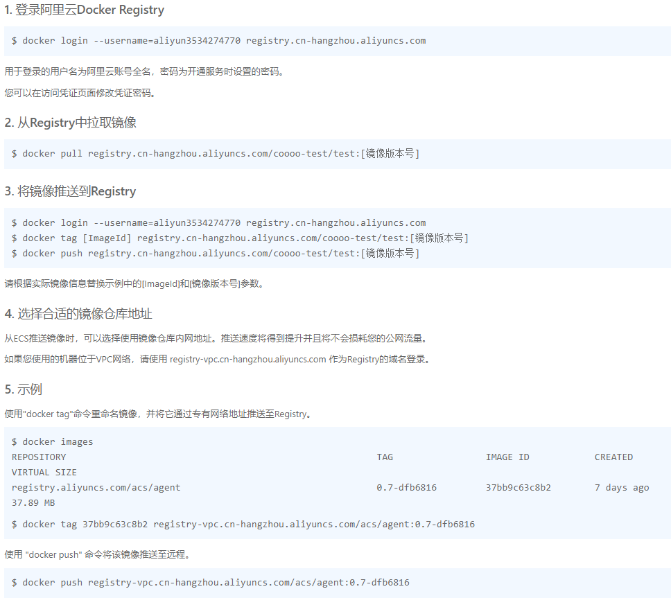

## 简介

### 虚拟化

虚拟化是一种计算机资源管理技术。  
指通过虚拟化技术将一台计算机虚拟为多台逻辑计算机。在一台计算机上同时运行多个逻辑计算机，每个逻辑计算机可运行不同的操作系统，并且应用程序都可以在相互独立的空间内运行而互不影响，从而显著提高计算机的工作效率。  

虚拟化分类（略，因为过于复杂，了解即可）  

优点：一台物理机可以虚拟化多个服务器，让计算机资源利用更充分。  
缺点：
1. 每个虚拟机都会创建一个操作系统，会增加资源的消耗。
2. 环境兼容问题。  

### 容器技术

运行在操作系统之上的虚拟化技术，模拟的运行在一个操作系统上的多个不同进程，封装在容器中。  

docker发布于2013年，基于LXC技术。
LXC是linux Container，是一种内核虚拟化技术。提供轻量级的虚拟化，以便隔离进程和资源。与宿主机使用同一内核，性能损耗小。

docker是开源的应用容器引擎，基于go语言实现。
[docker官网](https://www.docker.com/)
docker技术可以让开发者将开发好的应用和依赖包打包到容器中，以便可以运行在任意linux服务器上，解决开发环境与运维环境不同的问题。  
docker本省不是容器，是管理容器的引擎。  

## 环境搭建

### 安装

docker支持CentOS6及以上版本。  
CentOS7可以使用`yum install docker -y`直接安装。  

### 服务启动关闭等

启动：`systemctl start docker`或者`service docker start`
停止：`systemctl stop docker`或者`service docker stop`
重启：`systemctl restart docker`或者`service docker restart`
查看运行状态：`systemctl status docker`或者`service docker status`

查看docker系统信息：`docker info`
查看docker所有帮助信息：`docker`
查看某个命令帮助信息：`docker commond --help`

### docker运行机制

启动服务-->下载镜像-->启动该镜像得到一个容器-->容器里运行应用

1. 启动服务
2. 下载镜像，如果本地没有对应镜像，则会从镜像仓库下载，[默认仓库](https://hub.docker.com)  
搜索镜像：`docker search tomcat`
下载镜像：`docker pull tomcat`
运行镜像：`docker run tomcat` 后台运行：`docker run -d tomcat`
-p 参数映射端口
显示本地已有镜像：`docker images`

### 进入docker容器

进入容器：`docker exec -it 容器id bash`  
i表示交互式的，即保持标准输入流打开  
t表示虚拟控制台  
退出容器：`exit`

从客户机访问容器，需要有端口映射，docker容器默认采用桥接模式与宿主机通信，需要将宿主机ip端口映射到容器ip端口上。  
停止容器：`docker stop 容器id/名称`  
启动容器：`docker run -d -p 8080:8080 tomcat`

## docker核心组件

docker是客户端-服务器（C/S）加厚，通过远程API来管理和创建容器。  
docker通过镜像来创建容器。  

### 镜像

镜像是一个只读的模板，用于创建容器。

镜像由许多层文件系统构成  
第一层是引导文件系统bootfs  
第二层是root文件系统rootfs，root文件系统通常是某种操作系统  
root系统之上又有很多层文件系统，这些文件系统叠加在一起，构成docker中的镜像

进入容器：`docker exit -it 镜像id bash`
删除镜像：`docker rmi 镜像名`，rm是删除容器

### 容器

通过镜像启动容器：`docker run -d 镜像名`
查看运行中的容器：`docker ps`
查看所有的容器：`docker ps -a`
停止容器：`docker stop 容器id/名称`
开启容器：`docker start 容器id/名称`
删除容器：`docker rm 容器id/名称` 删除容器时，容器必须是静止状态，否则会报错
查看容器更多信息：`docker inspect 容器id/名称`
停止全部运行中的容器：`docker stop $(docker ps -q)`
删除全部容器：`docker rm $(docker ps -aq)`

### 仓库

仓库是集中存放镜像文件的地方。仓库分为公开仓库和私有仓库。
最大的公开仓库是[Docker Hub](https://hub.docker.com/)

[阿里云镜像](https://dev.aliyun.com)

查找官方镜像：`docker search 镜像名`
下载镜像：`docker pull 镜像名`

## 自定义镜像

dockerfile用于构建docker镜像，有一行行命令语句构成，基于这些命令可以构建一个镜像。  

dockerfile分为四部分
1. 基础镜像信息
2. 维护者信息
3. 镜像操作命令
4. 容器启动时执行指令

### 指令

1. FROM
`FROM <images> / FROM <images>:<tag> / FROM <images>:<digest>`
用于指定所使用的基础镜像
> FROM必须是dockerfile第一条非注释指令  
> FROM可以出现多次，用于在一个dockerfile中创建多个镜像  
> tag/digest是可选的，默认latest版本基础镜像
2. MAINTAINER
`MAINTAINER <name>`
指定维护者信息
3. ENV
`ENV <key> <value> / ENV <key1>=<value1> <key2>=<value2>...`
设置环境变量，会被后续RUN指令使用，并在容器运行时保持。
4. COPY
`ADD <源路径>... <目标路径> / ADD ["<源路径>",... "<目标路径>"]`
复制指定文件到容器中指定位置。
> 源文件的各种元数据都会保留。比如读、写、执行权限、文件变更时间等。
5. ADD
`ADD <源路径>... <目标路径> / ADD ["<源路径>",... "<目标路径>"]`
复制指定文件到容器中指定位置，与COPY格式基本一致，但比COPY增加了一些功能。如源路径可以是url
> 如果 docker 发现文件内容被改变，则接下来的指令都不会再使用缓存。
6. RUN
~~~shell
#shell格式
RUN <command>
#exec格式
RUN ["executable", "param1", "param2"]
~~~
用于构建过程中，执行特定命令，并生成一个中间镜像。  
> RUN 指令创建的中间镜像会被缓存，并会在下次构建中使用。如果不想使用这些缓存镜像，可以在构建时指定 --no-cache 参数，如：docker build --no-cache。
7. CMD
~~~shell
CMD ["executable","param1","param2"]
CMD ["param1","param2"]
CMD command param1 param2
~~~
用于指定容器启动时命令。
> 与 RUN 指令的区别：RUN 在构建的时候执行，并生成一个新的镜像，CMD 在容器运行的时候执行，在构建时不进行任何操作。
> 每个dockerfile只能有一条CMD命令。如果有多条，只有最后一条会被执行。
> 如果用户启动时指定了运行的命令，则会覆盖CMD指定的命令。
8. EXPOSE
`EXPOSE <port> [<port>...]`
为构建的镜像设置监听端口，使容器运行时监听

### 自定义镜像

1. JDK镜像
创建Dockerfile文件
~~~shell
FROM centos
MAINTAINER root
ADD jdk-8u121-linux-x64.tar.gz /usr/local
ENV JAVA_HOME /usr/local/java/jdk1.8.0_121
ENV CLASSPATH $JAVA_HOME/lib/dt.jar:$JAVA_HOME/lib/tools.jar
ENV PATH $PATH:$JAVA_HOME/bin
CMD java -version
~~~
构建镜像：`docker build -t root_jdk1.8.0_121 .`

2. tomcat镜像
   创建Dockerfile文件
~~~shell
FROM root_jdk1.8.0_121
MAINTAINER root
ADD apache-tomcat-8.5.24.tar.gz /usr/local
ENV CATALINA_HOME /usr/local/apache-tomcat-8.5.24
ENV PATH $PATH:$CATALINA_HOME/lib:$CATALINA_HOME/bin
EXPOSE 8080
CMD /usr/local/apache-tomcat-8.5.24/bin/catalina.sh run
~~~
构建镜像：`docker build -t root_tomcat-8.5.24 .`

### 镜像发布到仓库

省略
在阿里云注册账号，容器镜像服务有详细文档。

### Docker Hub 镜像加速

/etc/docker/daemon.json
`{"registry-mirrors": ["阿里云提供的网址"]}`

## docker应用部署

1. 将开发好的程序打成jar包或war包
2. 将打包好的文件上传至服务器
3. 定义Dockerfile文件，用于创建项目镜像

定义jar包程序Dockerfile文件
~~~shell
FROM java
MAINTAINER root
ADD springboot-web.jar /opt
RUN chmod +x /opt/springboot-web.jar
CMD java -jar /opt/springboot-web.jar
~~~
构建镜像：`docker build -t springboot-web.jar .`

定义war包程序Dockerfile文件
~~~shell
FROM root_tomcat-8.5.24
MAINTAINER root
ADD springboot-web.war /usr/local/apache-tomcat-8.5.24/webapps
EXPOSE 8080
CMD /usr/local/apache-tomcat-8.5.24/bin/catalina.sh run
~~~
构建镜像：`docker build -t springboot-web.war .`

修改容器保存：`docker commit 容器id 镜像名`
容器内有新的数据，可以保存为新的镜像。

## 总结

主要是一些命令，但花了挺长时间。
主要碰到了两个问题。

第一个问题：
无法启动tomcat
~~~text
Cannot find /usr/local/tomcat/bin/setclasspath.sh
This file is needed to run this program
~~~
我不知道出现问题的原因是什么，但是找到了[解决方案](https://www.5axxw.com/questions/content/fypkh1)  
我将tomcat的版本降低后，解决了这个问题。

第二个问题：
也是无法启动tomcat
~~~text
/usr/bin/docker-current: Error response from daemon: driver failed programming external connectivity on endpoint affectionate_leakey (31afb261a3eead766cd87d85a7d0b12d048379e3b8715f28367a61e27b228456): Error starting userland proxy: listen tcp 0.0.0.0:8080: bind: address already in use.
ERRO[0000] error getting events from daemon: net/http: request canceled
~~~
这个是因为端口占用，而导致的报错。
解决方案：kill占用的程序。
> 查看端口使用情况：`netstat -anp`
> 查看8080端口使用情况：`netstat -anp|grep 8080`

