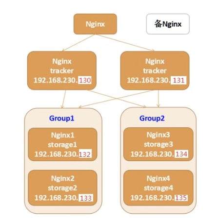
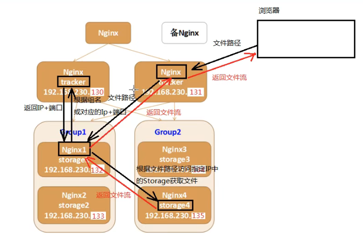

## 简介

### 分布式文件系统

分布式文件系统（Distributed File System，DFS）是指文件系统管理的物理存储资源不一定直接连接在本地节点上，而是通过计算机网络与节点（可简单的理解为一台计算机）相连；或是若干不同的逻辑磁盘分区或卷标组合在一起而形成的完整的有层次的文件系统。DFS为分布在网络上任意位置的资源提供一个逻辑上的树形文件系统结构，从而使用户访问分布在网络上的共享文件更加简便。单独的 DFS共享文件夹的作用是相对于通过网络上的其他共享文件夹的访问点。  
常见的分布式文件系统有：FastDFS、GFS、HDFS、Lustre、Ceph、GridFS、mogileFS、TFS等。

传统存放方式：

分布式文件存储：

### FastDFS

FastDFS是开源的轻量级分布式文件系统，为互联网应用定制，简单、灵活、高效。
采用c语言开发，由阿里巴巴开发并开源。
FastDFS对文件进行管理，功能包括：文件存储、文件同步（上传、下载、删除）等，解决大容量文件存储问题，特别适合以文件为载体的在线服务。比如文档网站、图片网址、视频网址等
FastDFS充分考虑了冗余备份、线性扩容等级制，并注重高可用、高性能等指标，使用它很容易搭建一套高性能的文件服务器集群提供文件上传下载等服务。

~~看起来做个人云盘什么的很不错~~

[FastDFS开源地址](https://github.com/happyfish100/fastdfs)

### FastDFS整体架构

FastDFS由客户端和服务端构成
客户端通常是我们的程序，比如用java去连接FastDFS、操作FastDFS。它提供了专有的api访问
服务端由跟踪器（tracker）和存储节点（storage）构成
跟踪器主要做调度工作，在内存中记录集群中存储节点storage的状态信息，是前端Client和后端存储节点storage的枢纽。因为相关信息存储在内存中，所以tracker server的性能非常高。
存储节点用于存储文件，包括文件和文件属性（meta data）都保存到存储服务器磁盘上，完成文件管理的所有功能：存储、同步、访问等

## 环境搭建

### 安装

旧版本 FastDFS 说明：
FastDFS有一部分是网络通信功能，旧版本FastDFS（FastDFS2.0之前版本）没有直接使用 epoll 实现，而是通过libevent实现（libevent是一个用C语言编写的、轻量级的开源高性能网络库），但是最新版的FastDFS最终网络IO这部分重新用epoll实现
所以如果是FastDFS 是 2.0 之前的版本，请先安装好 libevent 环境（新版本不需要安装）

安装前准备:
检查linux是否安装了gcc、libevent、libevent-devel
~~~shell
yum list installed|grep gcc
yum list installed|grep libevent
yum list installed|grep libevent-devel
~~~
安装
~~~shell
yum install gcc libevent libevent-devel -y
~~~

安装libfastcommon：
~~~shell
git clone https://github.com/happyfish100/libfastcommon.git
cd libfastcommon/
./make.sh
sudo ./make.sh install
~~~
> 头文件安装在/usr/include/fastcommon目录下
> 动态库安装在/usr/lib64/和/usr/lib/目录下

安装fastdfs
~~~shell
git clone https://github.com/happyfish100/fastdfs.git
cd fastdfs
./make.sh
sudo ./make.sh install
~~~
> 工具安装在/usr/bin/目录下：(无需配置环境变量，直接使用)
> fdfs_delete_file：删除文件
> fdfs_download_file：下载文件
> fdfs_upload_file：上传文件
> fdfs_trackerd：启动tracker服务
> fdfs_storaged：启动storage服务
> fdfs_file_info：用来检查一个文件的信息，参数传递一个FastDFS文件

> 配置文件默认安装在/etc/fdfs/目录下：
> client.conf.sample：客户端默认配置文件
> storage.conf.sample：storage服务默认配置文件
> storage_ids.conf.sample：
> tracker.conf.sample：tracker服务默认配置文件

### 启动与关闭

启动：
`fdfs_trackerd /etc/fdfs/tracker.conf`
`fdfs_storaged /etc/fdfs/storage.conf`

启动成功会有两个服务

重启：
`fdfs_trackerd /etc/fdfs/tracker.conf restart`
`fdfs_storaged /etc/fdfs/storage.conf restart`

关闭：
`fdfs_trackerd /etc/fdfs/tracker.conf stop`
`fdfs_storaged /etc/fdfs/storage.conf stop`

> 可以使用kill关闭，但不建议，因为可能会导致文件信息不同步问题

### 测试上传

上传测试：
`fdfs_test /etc/fdfs/client.conf upload 文件路径`
示例：
`fdfs_test /etc/fdfs/client.conf upload /root/test.txt`
返回信息：
~~~text
tracker_query_storage_store_list_without_group:
        server 1. group_name=, ip_addr=127.0.0.1, port=23000

group_name=group1, ip_addr=127.0.0.1, port=23000
storage_upload_by_filename
group_name=group1, remote_filename=M00/00/00/fwAAAWLygpOAUo-DAAAAGhtfdIk672.txt
source ip address: 127.0.0.1
file timestamp=2022-08-09 23:51:47
file size=26
file crc32=459240585
example file url: http://127.0.0.1/group1/M00/00/00/fwAAAWLygpOAUo-DAAAAGhtfdIk672.txt
storage_upload_slave_by_filename
group_name=group1, remote_filename=M00/00/00/fwAAAWLygpOAUo-DAAAAGhtfdIk672_big.txt
source ip address: 127.0.0.1
file timestamp=2022-08-09 23:51:47
file size=26
file crc32=459240585
example file url: http://127.0.0.1/group1/M00/00/00/fwAAAWLygpOAUo-DAAAAGhtfdIk672_big.txt
~~~

> 其中
> group_name=group1, remote_filename=M00/00/00/fwAAAWLygpOAUo-DAAAAGhtfdIk672.txt
> group1 为 组名、M00 为 磁盘、/00/00/ 为 目录、最后是文件名

上传后的文件
~~~shell
(base) [root@VM-16-9-centos 00]# ll
total 16
-rw-r--r-- 1 root root 26 Aug  9 23:51 fwAAAWLygpOAUo-DAAAAGhtfdIk672_big.txt
-rw-r--r-- 1 root root 49 Aug  9 23:51 fwAAAWLygpOAUo-DAAAAGhtfdIk672_big.txt-m
-rw-r--r-- 1 root root 26 Aug  9 23:51 fwAAAWLygpOAUo-DAAAAGhtfdIk672.txt
-rw-r--r-- 1 root root 49 Aug  9 23:51 fwAAAWLygpOAUo-DAAAAGhtfdIk672.txt-m
~~~
> _big是备份文件，与没有的文件存储内容一样
> -m是文件的属性文件

### 测试下载

上传测试：
`fdfs_test /etc/fdfs/client.conf download 组名 远程文件路径`
示例：
`fdfs_test /etc/fdfs/client.conf download group1 M00/00/00/fwAAAWLygpOAUo-DAAAAGhtfdIk672.txt`
返回信息：
~~~text
storage=127.0.0.1:23000
download file success, file size=26, file save to fwAAAWLygpOAUo-DAAAAGhtfdIk672.txt
~~~

删除文件测试：
`fdfs_test /etc/fdfs/client.conf delete 组名 远程文件路径`

## FastDFS的http访问

### 概述

文件上传成功的提示信息中说，我们可以通过某个路径访问上传的文件，但直接访问这个路径是访问不了的。
FastDFS提供了一个Nginx扩展模块，利用这个模块，可以通过nginx访问已经上传到FastDFS上的文件。

[FastDFS-nginx扩展模块](https://github.com/happyfish100/fastdfs-nginx-module)

### 安装nginx并添加扩展模块

解压缩扩展模块。

配置nginx
使用`./configure --prefix=/usr/local/nginx_fdfs --add-model=扩展模块的src目录`添加拓展模块
配置完成后`make`
然后`make install`安装nginx

### 配置nginx

FastDFS配置(mod_fastdfs.conf)

基础路径
`base_path=...`
tracker_server地址
`tracker_server=...:22122`
请求中需要包含组名
`url_have_group_name = true`
有几个磁盘存储路径
`store_path_count=1`
文件存储路径
`store_path0=...`

nginx配置(nginx.conf)

拦截请求路径中包含 /group[1-9]/M0[0-9] 的请求，用fastdfs的nginx模块进行转发
~~~conf
location ~/group[1-9]/M0[0-9]{
    ngx_fastdfs_model;
}
~~~

启动失败可能的原因：
1. mod_fastdfs.conf没有放到/etc/fdfs目录中
2. 配置文件中有错误。比如基础路径不存在

### 拓展模块执行流程

## 使用Java程序对FastDFS进行操作

[fastdfs-client-java 项目地址](https://github.com/happyfish100/fastdfs-client-java)

maven依赖
~~~xml
<!--
    引入FastDFS的maven依赖包
    这个依赖包不在maven的中央库中，需要对源码进行编译，将客户端代码编译到maven本地库中或直接拷贝依赖包文件到maven库中。
-->
    <dependency>
        <groupId>org.csource</groupId>
        <artifactId>fastdfs-client-java</artifactId>
        <version>1.29-SNAPSHOT</version>
    </dependency>
~~~

创建配置文件（fastdfs.conf）
~~~conf
tracker_server=127.0.0.1:22122
~~~

文件上传：
~~~java
public static void upload() {
    TrackerServer ts = null;
    StorageServer ss = null;
    try {
        //读取配置文件，用于将所有的tracker的地址读取到内存中
        ClientGlobal.init("fastdfs.conf");
        TrackerClient tc = new TrackerClient();
        ts = tc.getTrackerServer();
        ss = tc.getStoreStorage(ts);
        //定义Storage的客户端对象，需要用这个对象来完成文件上传、下载、删除操作。
        StorageClient sc = new StorageClient(ts, ss);
        /*
        文件上传
        参数1 需要上传文件的绝对路径
        参数2 需要上传文件的拓展名
        参数3 为文件的属性文件，通常不上传
        返回一个string数组，需妥善保管
        数组中第一个元素为文件所在组名，第二个元素为文件所在的远程路径名称
         */
        String[] result = sc.upload_file("", "", null);
        
    } catch (IOException | MyException e) {
        e.printStackTrace();
    }
}
~~~

文件下载：
~~~java
public static void download() {
    TrackerServer ts = null;
    StorageServer ss = null;
    try {
        //读取配置文件，用于将所有的tracker的地址读取到内存中
        ClientGlobal.init("fastdfs.conf");
        TrackerClient tc = new TrackerClient();
        ts = tc.getTrackerServer();
        ss = tc.getStoreStorage(ts);
        //定义Storage的客户端对象，需要用这个对象来完成文件上传、下载、删除操作。
        StorageClient sc = new StorageClient(ts, ss);
        /*
        文件下载
        参数1 需要下载的文件的组名
        参数2 需要下载文件的远程文件名
        参数3 需要保存的本地文件名
        返回一个int类型的数据。返回0 表示文件下载成功，其他值表示文件下载失败
         */
        int result = sc.download_file("", "", "");
    } catch (MyException | IOException e) {
        e.printStackTrace();
    }
}
~~~

文件删除：
~~~java
public static void delete(){
    TrackerServer ts = null;
    StorageServer ss = null;
    try {
        //读取配置文件，用于将所有的tracker的地址读取到内存中
        ClientGlobal.init("fastdfs.conf");
        TrackerClient tc = new TrackerClient();
        ts = tc.getTrackerServer();
        ss = tc.getStoreStorage(ts);
        //定义Storage的客户端对象，需要用这个对象来完成文件上传、下载、删除操作。
        StorageClient sc = new StorageClient(ts, ss);
        /*
        文件下载
        参数1 需要删除的文件的组名
        参数2 需要删除文件的远程文件名
        返回一个int类型的数据。返回0 表示文件删除成功，其他值表示文件删除失败
         */
        int result = sc.delete_file("", "");
    } catch (MyException | IOException e) {
        e.printStackTrace();
    }
}
~~~

springboot中关于上传文件大小的配置
~~~properties
#设置springMVC允许上传的单个文件大小 默认值为1MB
spring.servlet.multipart.max-file-size=1MB
#设置springMVC允许的表单中请求中允许上传文件总大小 默认值为10MB
spring.servlet.multipart.max-request-size=10MB
~~~

## 集群的访问流程

集群结构：

访问流程：

## 总结

部署分布式的部分省略了。咕
这部分用了快十天，划水划了挺久。不过总算结束了。
