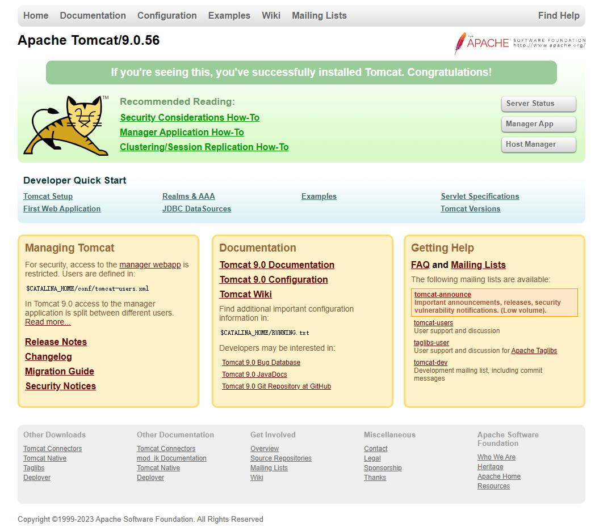

## Tomcat 简介

Tomcat 服务器是一个免费的开放源代码的 Web 应用服务器。应用十分广泛，毕竟免费好用。

[Tomcat 官网](https://tomcat.apache.org/)
[Tomcat 与 servlet、jsp、jdk 的版本支持](https://tomcat.apache.org/whichversion.html)

Tomcat 目录结构：

| 目录      | 说明                                    |
|---------|---------------------------------------|
| bin     | 命令中心（启动、关闭等命令）                        |
| conf    | 配置中心（核心配置 server.xml）                 |
| lib     | Tomcat 的库文件。Tomcat 运行时需要的 jar 包所在的目录。 |
| logs    | 存放日志文件。                               |
| temp    | 存储临时产生的文件，即缓存。                        |
| webapps | 存放项目的文件，web 应用放置到此目录下浏览器可以直接访问。       |
| work    | 存放编译以后的 class 文件。                     |

下载 tomcat 压缩包后，解压并启动 tomcat
便可以看见如下画面，即启动成功。

部署应用，将 web 项目打包成 war 包，放在 webapps 目录下启动 tomcat 即可。

## Tomcat 执行流程

Tomcat 是 Http 服务器 + Servlet 容器。
对我们屏蔽了应用层和网络层的协议（即不用我们去处理 TCP 连接，以及对 HTTP 报文的解析），给我们提供了标准的 Request 和 Response 对象。
我们只需要从 request 中获取请求参数，然后调用业务逻辑，最后构建 Response 对象返回即可。
至于 TCP 连接 和 HTTP 协议的数据处理和响应，Tomcat 会帮我们完成。
实现了 HTTP 服务器与业务类的解耦。

详细架构就不仔细介绍了，放几篇文章：

[Tomcat 架构原理解析到架构设计借鉴](https://segmentfault.com/a/1190000023475177)
[四张图带你了解Tomcat系统架构](https://blog.csdn.net/xlgen157387/article/details/79006434)
[Tomcat 的体系结构（超详细）](https://blog.csdn.net/weixin_40599109/article/details/107720950)

介绍执行流程之前，先介绍几个概念（上面的文章中也有）：

1. Server：服务器，启动一个 tomcat 就是启动了一个服务器，一个 Server 可以有多个 Service ，一个 Service 可以有多个 Connector 和 Engine
2. Service：服务，一个 server 可以包含多个 service 一个 service 维护多个 Connector 和一个 Engine
3. Engine：叫引擎，也有资料叫 Container ，一个服务可以开一个引擎，就是一个公司可以有很多个门，不同身份的人从不同的门进，但是具体干活的就一个部门。引擎负责处理请求，不需要考虑请求链接，协议等。
4. Context：一个 Context 管理一个应用，其实就是我们写的程序。
5. Wrapper：每个都封装着一个 Servlet（当然只局限于普通的 Http 请求）。

下面是 Tomcat 的执行流程：
比如用户发送一个请求： http://localhost:8080/test/index.jsp

1. 我们的请求被发送到本机端口8080，被在那里侦听的 Coyote HTTP/1.1 Connector 获得。
2. Connector 把该请求交给它所在的 Service 的 Engine 来处理，并等待来自 Engine 的回应 。
3. Engine 获得请求 localhost:8080/test/index.jsp ，匹配它所拥有的所有虚拟主机 Host ，我们的虚拟主机在 server.xml 中默认配置的就是 localhost。
4. Engine 匹配到 name=localhost 的 Host（即使匹配不到也把请求交给该 Host 处理，因为该 Host 被定义为该 Engine 的默认主机）。
5. localhost Host 获得请求 /test/index.jsp ，匹配它所拥有的所有 Context。
6. Host 匹配到路径为 /test 的 Context（如果匹配不到就把该请求交给路径名为””的Context去处理）。
7. path=”/test” 的 Context 获得请求 /index.jsp，在它的 mapping table 中寻找对应的 servlet 。
8. Context 匹配到 URL PATTERN 为 *.jsp 的 servlet，对应于 JspServlet 类。
9. 构造 HttpServletRequest 对象和 HttpServletResponse 对象，作为参数调用 JspServlet 的 doGet 或 doPost 方法 。
10. Context 把执行完了之后的 HttpServletResponse 对象返回给 Host 。
11. Host 把 HttpServletResponse 对象返回给 Engine 。
12. Engine 把 HttpServletResponse 对象返回给 Connector 。
13. Connector 把 HttpServletResponse 对象返回给客户 browser 。

所以我们在使用 tomcat 时，不需要理会中间过程（HTTP怎么解析，TCP怎么连接）。
只需要写好 servlet 和 对应的映射关系即可。

## Servlet 简介

Servlet（Server Applet） 是基于 Jakarta 技术的 Web 组件，由容器管理，可生成动态内容。
与其他基于 Jakarta 技术的组件一样，servlet 是独立于平台的 Java 类，它们被编译为与平台无关的字节码，这些字节码可以动态加载到支持 Jakarta 技术的 Web 服务器中并由其运行。
容器，有时也称为 servlet 引擎，是提供 servlet 功能的 Web 服务器扩展。
Servlet 通过 servlet 容器实现的请求/响应范式与 Web 客户端交互。

Servlet 容器是 Web 服务器或应用程序服务器的一部分，它提供发送请求和响应的网络服务、解码基于 MIME 的请求以及格式化基于 MIME 的响应。Servlet 容器还通过其生命周期包含和管理 Servlet。
Servlet 容器可以内置到主机 Web 服务器中，也可以通过该服务器的本机扩展 API 作为附加组件安装到 Web 服务器。Servlet 容器也可以内置于或可能安装在支持 Web 的应用程序服务器中。
所有 Servlet 容器都必须支持 HTTP 作为请求和响应的协议，但可以支持其他基于请求/响应的协议，例如 HTTPS（基于 SSL 的 HTTP）。容器必须实现的 HTTP 规范的必需版本是 HTTP/1.1 和 HTTP/2。
Java SE 8 是必须用来构建 Servlet 容器的底层 Java 平台的最低版本。

更多可以参考[菜鸟教程-servlet教程](https://www.runoob.com/servlet/servlet-tutorial.html)

## Servlet 生命周期

Servlet 生命周期可被定义为从创建直到毁灭的整个过程。

以下是 Servlet 遵循的过程：

1. Servlet 初始化后调用 init () 方法。
2. Servlet 调用 service() 方法来处理客户端的请求。
3. Servlet 销毁前调用 destroy() 方法。

最后，Servlet 是由 JVM 的垃圾回收器进行垃圾回收的。

> 首次访问 servlet 时，init() 方法会被执行，并且会执行 service() 方法
> 再次访问时，只会执行 service() 方法
> 关闭 web 容器时，会执行 destroy() 方法

## Servlet 使用

创建 servlet 有三种方式：

1. 实现 javax.servlet.Servlet 接口。
2. 继承 javax.servlet.GenericServlet 类。
3. 继承 javax.servlet.http.HttpServlet 类。

一般使用第三种方式进行 servlet 的创建。
创建完成后，需要在 web.xml 中完成 servlet 的配置（映射关系之类的）才可以使用。

例如：
servlet:

~~~java
public class ServletTest extends HttpServlet {
    @Override
    protected void doGet(HttpServletRequest req, HttpServletResponse resp) throws ServletException, IOException {
        PrintWriter printWriter = resp.getWriter();
        printWriter.println("ServletTest");
    }

    @Override
    protected void doPost(HttpServletRequest req, HttpServletResponse resp) throws ServletException, IOException {
        doGet(req, resp);
    }
}
~~~

别忘了在 web.xml 中添加映射:

~~~xml
<web-app>
    <servlet>
        <servlet-name>ServletTest</servlet-name>
        <servlet-class>servletProject.servlet.ServletTest</servlet-class>
    </servlet>
    <servlet-mapping>
        <servlet-name>ServletTest</servlet-name>
        <url-pattern>/ServletTest</url-pattern>
    </servlet-mapping>
</web-app>
~~~

servlet 中详细的方法用法可以参考菜鸟教程，有比较详细的文档。
关于 web.xml 中 servlet 的匹配规则也不详细列举了。

## 关于 JSP

JSP 全称 Java Server Pages，是一种动态网页开发技术。它使用 JSP 标签在 HTML 网页中插入 Java 代码。标签通常以 <% 开头以 %> 结束。
JSP 是一种 Java servlet，主要用于实现 Java web 应用程序的用户界面部分。网页开发者们通过结合 HTML 代码、XHTML 代码、XML 元素以及嵌入 JSP 操作和命令来编写 JSP。

由于 jsp 以及被淘汰了，所以就放个教程的链接。后面的内容也只是做简单介绍，不做具体使用。
[菜鸟教程-jsp教程](https://www.runoob.com/jsp/jsp-tutorial.html)

首先，来讲下 jsp 出现的原因：
因为 tomcat 的出现，我们只需要写 servlet 就可以完成 web 请求。
但是 servlet 主要功能在于交互式地浏览和生成数据，生成动态 Web 内容。
而动态响应的内容是写在 servlet（java代码）中的，即我们需要在 Java 中使用字符串拼接 html 页面。
这显然是很麻烦，并且低效，阅读性差的工作。
所以 jsp 就诞生了，既能写 java 代码，又能写 html。

JSP 的实现原理：
JSP 的本质其实还是 servlet。
因为浏览器向服务器发送请求，无论访问什么资源，其实都是在访问 servlet。
服务器在执行 jsp 的时候，首先把 jsp 编译成一个 Java（servlet） 文件，然后将 Java 文件编译为 class 文件，加载到容器中。
最后和其他的 servlet 一样，创建实例，初始化，调用 service() 方法，将 html 返回给客户端。

JSP 的缺点（不好用的地方）：

- 动态资源与静态资源耦合在一起，无法做到前后端分离。并且服务端压力也大，一旦服务器出现问题，整个网站前后端一起寄。
- 前端做好网页后，需要后端改成 jsp 页面。沟通成本巨大、出错的概率也大、修改起来也麻烦（需要双方的协同开发）、效率因此也低。
- JSP 必须要在支持 Java 的容器（tomcat）中运行，而无法使用 nginx 等。nginx 的性能很高。
- 第一次请求 jsp ，需要经过编译。速度较慢。

所以后面才会发展出**视图解析器**以及 **Thymeleaf 模板引擎** 等技术来解决前端资源根据需求动态生成的问题。
再往后就是前后端更加彻底的分离，vue+springboot 这种，可以将静态资源完全交由前端处理，后端仅实现数据接口的模式。

## end

说白了就是解耦，专业的人干专业的事。