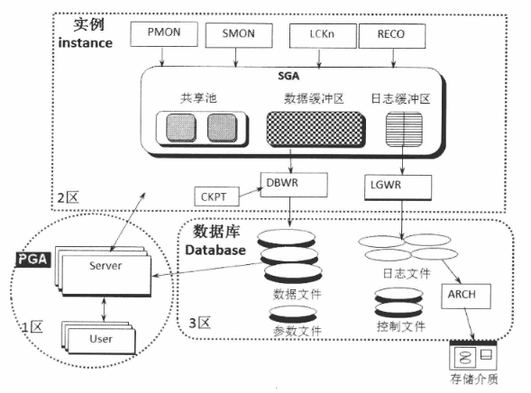

## 前言

由于想深入了解下数据库，包括索引、分区表以及sql优化相关的知识，加上工作使用的是 Oracle 数据库。所以选择这本书开始学习。
最开始看的时候，已经看了四章了。但是不做笔记，总是看了后面忘了前面，所以决定重读并且记笔记。主要及一些重点，方便以后查阅和回忆。
（当然，可能会有很多引用原文的部分，也会有自己的总结。引用的部分就不一一标注了，不过基本也能看出来）

## 省略的第一章 - 意识，少做事从学习开始

这一章的重点就是，**学什么要先了解做什么**。学了没想过怎么用，或者干脆不用，基本上是白学的。
先讲下数据库应用的基本功能，再根据具体的角色（DBA、开发、运维等）看具体该如何使用，根据使用的侧重点不同，而对数据库不同进行深度的学习。
毕竟数据库体系是庞大的，想要全盘掌握不现实，也不必要。按需学习即可。

这里作者是以手机的例子，加以二八现象说明。即百分之二十的功能实现百分之八十的需求，数据库也是一样。
对于开发人员来说，首先应该了解 SQL 的编写，而不是数据库的备份和恢复。而对于运维或者DBA来说，了解数据库的备份和恢复则更为重要。

首先，数据库应用的功能主要分为 数据库开发、数据库管理、数据库优化、数据库设计 四类（当然只是大概）。侧重点如下：

1. 开发：能利用SQL完成数据库的查增删改的基本操作：能用PL/SQL完成及各类逻辑的实现。
2. 管理：能完成数据库的安装、部署、参数调试、备份恢复、数据迁移等系统相关的工作：能完成分配用户、控制权限、表空间划分等管理相关工作：能进行故障定位、问题分析等数据库诊断修复相关工作。
3. 优化：在深入了解数据库的运行原理的基础上，利用各类工具及手段发现并解决数据库存在的性能问题，从而提升数据库运行效率，这个说着轻巧，其实很不容易。
4. 设计：深刻理解业务需求和数据库原理，合理高效地完成数据库模型的建设，设计出各类表及索引等数据库对象，让后续应用开发可以高效稳定。


我的角色目前是开发，后续笔记中也会侧重于开发的内容。除此之外，也会带一些我感兴趣的内容。

## 第二章 - 震惊，体验物理体系之旅

不论什么角色，基础原理都是必学的。首先就是物理体系结构，平时遇到的各种数据库相关问题，很多都可以从中找到解决方法。



1. **Oracle由实例和数据库组成**，我特意用两个虚框标记出来，上半部的直角方框为实例instance,下半部的圆角方框为数据库Database,大家可以看到我在虚线框左上角做的标注。
2. **实例是由一个开辟的共享内存区SGA(System Global Area)和一系列后台进程组成的**，其中**SGA最主要被划分为共享池(shared pool)、数据缓冲区(db cache)和日志缓冲(log buffer)三类**。后台进程包括图2-2中所示的PMON、SMON、LCKn、RECO、CKPT、DBWR、LGWR、ARCH等系列进程。
3. 数据库是由数据文件、参数文件、日志文件、控制文件、归档日志文件等系列文件组成的，其中归档日志最终可能会被转移到新的存储介质中，用于备份恢复使用。大家请注意看图2-2中的圆形虚线框标记部分的一个细节，**PGA(Program Global Area)区，这也是一块开辟出来的内存区，和SGA最明显的差别在于，PGA不是共享内存，是私有不共亨的**，S理解为共享的首字母。用户对数据库发起的无论查询还是更新的任何操作，都是在PGA先预处理，然后接下来才进入实例区域，由SGA和系列后台进程共同完成用户发起的请求。
4. PGA起到的其体作用，也就是前面说的预处理，是什么呢？主要有三点：第一，保存用户的连接信息，如会话属性、绑定变量等：第二，保存用户权限等重要信息，当用户进程与数据库建立会话时，系统会将这个用户的相关权限查询出来，然后保存在这个会话区内：第三，当发起的指令需要排序的时候，PGA(Program Global Area)正是这个排序区，如果在内存中可以放下排序的尺寸，就在内存PGA区内完成，如果放不下，超出的部分就在临时表空间中完成排序，也就是在磁盘中完成排序。
5. 我在图中标识了三块区域（大家注意看虚线框的左下角标注），分别是1区圆形虚线框，2区直角方形虚线框，3区圆角方形虚线框。用户的请求发起经历的顺序一般如下：1区→2区→3区：或者1区→2区。

从这个体系结构可以提出一些问题，提问很重要！

1. 为什么会有用户的请求不经过3区数据库的情况，直接从2区实例返回了？
2. 为什么SGA要划分为共享池、数据缓冲区、日志缓冲区，它们的作用分别是什么？
3. 为什么数据量大时排序会导致sql执行非常缓慢？（这个问题从上面的体系结构中显而易见）

### 从普通查询 sql 开始

从简单的查询sql `select object_name from t where object_id=29;` 开始。
当用户发起这个sql指令后，首先会从1区开始做准备。

PGA区域是仅供当前发起用户使用的私有内存空间，这个区域有三个作用，但这里的连接只完成了**用户连接信息的保存和q权限的保存**。只要该session不断开连接，下次便可以直接从PGA中获取，而不用去硬盘中读取数据。
此外，该sql还会匹配成一条唯一的HASH值，然后进入2区域。首先进入SGA区的共享池。
进入共享池后，先查询是否有地方存储过这个sql（HASH值，唯一标识一个sql）。

如果没有，那首先就要查询这个sql语法是否正确（from是否写成form），语义是否正确（字段、表是否存在），是否有权限。都没问题则会生成唯一HASH并保存。
接下来开始解析，看是否有索引，是索引读高效还是全表扫描高效？oracle要做出抉择。

如何做出抉择？将两种方式都估算一下，看那个代价（COST）更低。这里比较并不会真正分别执行两次来比较，具体方法后文会有。将代价更低的执行计划保存起来，并于HASH对应起来。
有了执行计划之后，便来到数据缓冲区来查询数据了。当数据缓冲区找不到需要的数据时，便会去3区的数据库中查找，当然得按照执行计划来，这是圣旨，不可违抗。找到后，回到数据缓冲区返回，找不到，就找不到了。

1. 这里2区中的日志缓冲区并没有说到
2. 3区也只描述了一个数据文件，其他文件并没有被提及
3. 2区中除了SGA，还有很多进程，他们的作用也没有被提及

下面开始实践，可以先跳至文末，搭建Oracle的环境。

~~~sql
drop table t;
create table t as
select *
from all_objects;
create index idx_object_id on t (object_id);
-- 跟踪SQL的执行计划和执行的统计信息
set autotrace on
-- 设置查询结果在屏幕上显示时每行的最大字符数，使得查询结果不被截断，提高可读性
set linesize 1000
-- 跟踪该语句执行完成的时间
set timing on
select object_name
from t
where object_id = 29;
~~~

第一次查询结果

~~~text
SQL> select object_name from t where object_id = 29;

OBJECT_NAME
--------------------------------------------------------------------------------------------------------------------------------
C_COBJ#

Elapsed: 00:00:00.67

Execution Plan
----------------------------------------------------------
Plan hash value: 1296629646

-----------------------------------------------------------------------------------------------------
| Id  | Operation                           | Name          | Rows  | Bytes | Cost (%CPU)| Time     |
-----------------------------------------------------------------------------------------------------
|   0 | SELECT STATEMENT                    |               |     1 |    79 |     2   (0)| 00:00:01 |
|   1 |  TABLE ACCESS BY INDEX ROWID BATCHED| T             |     1 |    79 |     2   (0)| 00:00:01 |
|*  2 |   INDEX RANGE SCAN                  | IDX_OBJECT_ID |     1 |       |     1   (0)| 00:00:01 |
-----------------------------------------------------------------------------------------------------

Predicate Information (identified by operation id):
---------------------------------------------------

   2 - access("OBJECT_ID"=29)

Note
-----
   - dynamic statistics used: dynamic sampling (level=2)


Statistics
----------------------------------------------------------
         11  recursive calls
          0  db block gets
         83  consistent gets
          1  physical reads
          0  redo size
        594  bytes sent via SQL*Net to client
        108  bytes received via SQL*Net from client
          2  SQL*Net roundtrips to/from client
          0  sorts (memory)
          0  sorts (disk)
          1  rows processed
~~~

第二次查询结果：

~~~text
SQL> select object_name from t where object_id = 29;

OBJECT_NAME
--------------------------------------------------------------------------------------------------------------------------------
C_COBJ#

Elapsed: 00:00:00.27

Execution Plan
----------------------------------------------------------
Plan hash value: 1296629646

-----------------------------------------------------------------------------------------------------
| Id  | Operation                           | Name          | Rows  | Bytes | Cost (%CPU)| Time     |
-----------------------------------------------------------------------------------------------------
|   0 | SELECT STATEMENT                    |               |     1 |    79 |     2   (0)| 00:00:01 |
|   1 |  TABLE ACCESS BY INDEX ROWID BATCHED| T             |     1 |    79 |     2   (0)| 00:00:01 |
|*  2 |   INDEX RANGE SCAN                  | IDX_OBJECT_ID |     1 |       |     1   (0)| 00:00:01 |
-----------------------------------------------------------------------------------------------------

Predicate Information (identified by operation id):
---------------------------------------------------

   2 - access("OBJECT_ID"=29)

Note
-----
   - dynamic statistics used: dynamic sampling (level=2)


Statistics
----------------------------------------------------------
          0  recursive calls
          0  db block gets
          4  consistent gets
          0  physical reads
          0  redo size
        594  bytes sent via SQL*Net to client
        108  bytes received via SQL*Net from client
          2  SQL*Net roundtrips to/from client
          0  sorts (memory)
          0  sorts (disk)
          1  rows processed
~~~

先简单介绍下统计信息中各个信息的含义：

* Recursive Calls: 表示查询执行期间数据库内部发生的递归调用次数，这可能包括子查询、视图的重写以及其他内部处理所需的多次查询执行。
* DB Block Gets: 指从数据库缓冲区中读取数据块的次数，反映的是从内存中获取数据的频率。
* Consistent Gets: 代表为维护数据一致性而从数据库缓存中获取数据块的次数。这在读一致性要求高的查询中尤为重要，确保查询看到的是事务开始那一刻的数据版本。
* Physical Reads: 指从磁盘上实际读取数据块的次数，发生物理读取通常意味着所需数据未在数据库缓冲区中找到，需要从持久存储中加载。
* Redo Size: 记录由于本次操作产生的重做日志大小，单位通常是字节。重做日志用于事务恢复。
* Bytes Sent via SQL*Net to Client: 通过SQL*Net网络协议发送到客户端的数据量，包括查询结果集等信息。
* Bytes Received via SQL*Net from Client: 通过SQL*Net网络协议从客户端接收的数据量，主要涉及客户端发送的查询请求等。
* SQL*Net Roundtrips to/from Client: 完成查询操作所需的客户端与服务器之间的网络往返次数，每次往返可能涉及请求或响应。
* Sorts (Memory): 在内存中执行的排序操作次数，用于组织数据以便于高效查询或显示。
* Sorts (Disk):当内存不足，需要使用临时表空间在磁盘上进行排序操作的次数，这通常比内存排序效率低。
* Rows Processed: 查询最终处理的行数，即查询结果集中包含的行数。

第一次执行花费0.67秒，第二次只花费了0.27秒。比第一次快了很多
接下来是统计信息的差别
第一次执行，产生了11次递归调用、83次逻辑读、1次物理读
第二次执行，产生了0次递归调用、4次逻辑读、0次物理读

下面是描述两次执行的差异：

1. 用户首次执行该SQL指令时，该指令从磁盘中获取用户连接信息和相关权限信息权限，并保存在PGA内存里。当用户再次执行该指令时，由于SESSION之前未被断开重连，连接信息和相关权限信息就可以在PGA内存中直接获取，避免了物理读。
2. 首次执行该SQL指令结束后，SGA内存区的共享池里已经保存了该SQL唯一指令HASH值，并保留了语法语意检查及执行计划等相关解析动作的劳动成果，当再次执行该$QL时，由于该SQL指令的HASH值和共享池里保存的相匹配了，所以之前的硬解析动作就无须再做，不仅跳过了相关语法语意检查，对于该选取哪种执行计划也无须考虑，直接拿来主义就好了。
3. 首次执行该SQL指令时，数据一般不在SGA的数据缓存区里（除非被别的SQL读入内存了)，只能从磁盘中获取，不可避免地产生了物理读，但是由于获取后会保存在数据缓冲区里，再次执行就直接从数据缓冲区里获取了，完全避免了物理读，就像上面的实践一样，首次执行物理读为4，第2次执行的物理读为0，没有物理读，数据全在缓存中，效率当然高得多！

即，不用获取用户和权限相关信息、不用进行语法检查和执行计划等相关解析、不用从磁盘获取直接从缓存获取。

### 体会Oracle的代价

在表有索引的情况下，Oracle可以选择索引读，也可以选择全表扫描，这是两种截然不同的执行计划，不见得一定是索引读胜过全表扫，有时索引读的效率会比全表扫更低
所以Oracle的选择不是看是啥执行计划，而是判断谁的代价更低。
下面来比较下两者的代价

这里会使用 HINT 的写法。HINT是一种强制写法，让数据库的查询优化器遵循某种特定的执行路径或采用特定的算法来处理查询。详细的介绍，放在文末。
使用 `/*+full(t)*/` 的写法，来强制该sql不走索引，走全表扫描。如下：
`select /*+full(t)*/object_name from t where object_id = 29;`

> 多次执行同一个SQL查询，可以解析次数减少、物理读减少甚至递归调用次数

下面是走全表扫描的执行结果：

~~~text
SQL> select /*+full(t)*/object_name from t where object_id = 29;

OBJECT_NAME
--------------------------------------------------------------------------------------------------------------------------------
C_COBJ#

Elapsed: 00:00:02.22

Execution Plan
----------------------------------------------------------
Plan hash value: 1601196873

--------------------------------------------------------------------------
| Id  | Operation         | Name | Rows  | Bytes | Cost (%CPU)| Time     |
--------------------------------------------------------------------------
|   0 | SELECT STATEMENT  |      |     1 |    79 |   410   (0)| 00:00:01 |
|*  1 |  TABLE ACCESS FULL| T    |     1 |    79 |   410   (0)| 00:00:01 |
--------------------------------------------------------------------------

Predicate Information (identified by operation id):
---------------------------------------------------

   1 - filter("OBJECT_ID"=29)

Note
-----
   - dynamic statistics used: dynamic sampling (level=2)


Statistics
----------------------------------------------------------
         81  recursive calls
          0  db block gets
       1649  consistent gets
       1518  physical reads
          0  redo size
        594  bytes sent via SQL*Net to client
        108  bytes received via SQL*Net from client
          2  SQL*Net roundtrips to/from client
          4  sorts (memory)
          0  sorts (disk)
          1  rows processed
~~~

## Oracle 环境的搭建

中间有段时间没有连着写，是去搭建Oracle环境了。毕竟公司的测试环境没有dba权限，还是自己搭一个比较好。
这里为了方便，采用官方的docker镜像进行部署。

首先用 `docker pull container-registry.oracle.com/database/free:latest` 拉取镜像。
镜像比较大，需要等一段时间。确保磁盘有足够的空间，我这里拉取的镜像id是 `7510f8869b04`
如果下载过慢，或者内存不足，可以参考下面修改docker的配置文件 `sudo vim /etc/docker/daemon.json`

~~~json
{
  "data-root": "/new_dir/docker",
  "registry-mirrors": [
    "http://hub-mirror.c.163.com"
  ]
}
~~~

data-root 是docker数据存储位置
registry-mirrors 是镜像加速地址，这里使用的是网易的镜像加速地址
保存后重启docker即可，`sudo systemctl start docker`

镜像拉取完成后，就可以构建启动容器了。
`docker run -d --name oracle -h oracle -p 1521:1521 -v /etc/localtime:/etc/localtime:ro container-registry.oracle.com/database/free:latest`

* -d: 这是一个标志，表示以守护态（detached mode）运行容器，即在后台运行，不会把容器的输出直接打印到当前终端。
* --name oracle: 为新创建的容器指定一个名字 oracle，便于后续引用和管理。
* -h oracle: 设置容器的主机名（hostname）为 oracle。这对于某些依赖主机名的应用配置是有帮助的。
* -p 1521:1521: 映射容器的端口 1521 到宿主机的端口 1521。这允许外部通过宿主机的 1521 端口访问容器中的 Oracle 数据库服务。
* -v /etc/localtime:/etc/localtime:ro: 使用卷挂载的方式，将宿主机的 /etc/localtime 文件或目录以只读（read-only）模式挂载到容器的 /etc/localtime。这样做是为了确保容器内的时间与宿主机保持一致，避免时区问题。

使用 `docker logs -f oracle` 查看容器日志，当出现 `DATABASE IS READY TO USE!` 时，即启动成功。
后面就可以愉快地使用Oracle了。

## HINT

在SQL查询中，HINT 是一种向数据库优化器提供提示的方式，用来指导SQL执行计划的选择。
HINT 不是SQL语言的标准组成部分，而是数据库特有的优化手段，它通常以注释的形式出现在SQL语句中，让数据库的查询优化器遵循某种特定的执行路径或采用特定的算法来处理查询。

在Oracle数据库中，HINT的写法通常是在表名或视图名后面紧跟一个特定的提示关键字或短语，这些提示被包围在 /*+ ... */ 注释符号内。例如，如果你想提示优化器使用特定的索引，可以这样写：

```sql
SELECT /*+ INDEX(table_name index_name) */ column1, column2
FROM table_name
WHERE some_condition;
```

在这个例子中，`INDEX(table_name index_name)` 是一个HINT，告诉优化器使用名为 `index_name` 的索引来访问 `table_name`。

还有一些常见的HINT，如：

- `FULL(table_name)` 强制全表扫描。
- `USE_NL(a b)` 强制使用嵌套循环连接(a表和b表)。
- `USE_HASH(a b)` 强制使用哈希连接(a表和b表)。
- `PARALLEL(table_name, degree)` 指定表并行查询的度数。
- `LEADING(table_name[, ...])` 指定连接顺序的起始表。

需要注意的是，使用HINT应当谨慎，**因为它们会绕过数据库自动优化机制，只有在明确知道优化器选择的执行计划不如预期高效时才应考虑使用。**
而且，随着数据库版本的更新或数据分布的变化，曾经有效的HINT可能不再是最优选择，因此定期审查和调整HINT是必要的。

