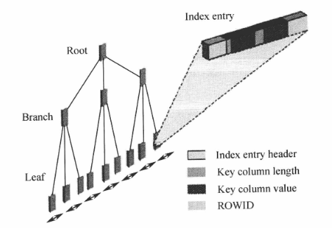
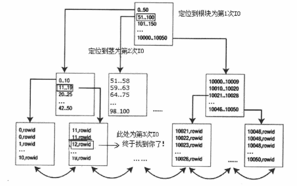
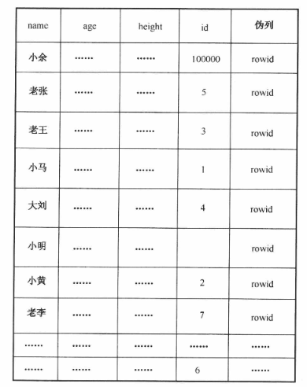
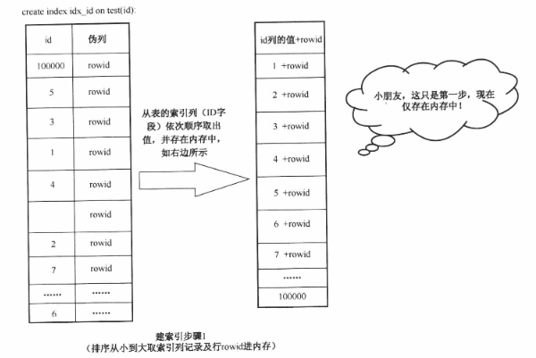
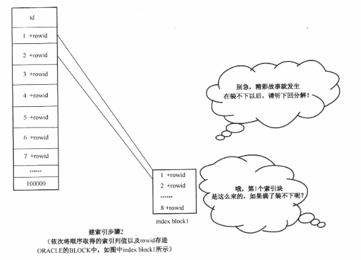
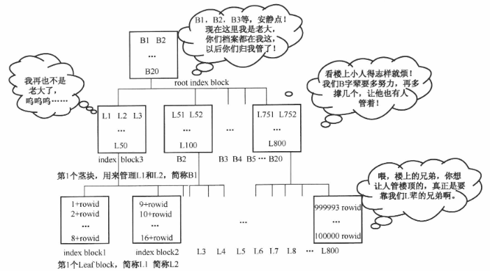

## 第四章 - 惊叹，索引天地妙不可言

### BTREE 索引

### BTREE 索引结构图

索引和表一样，都是前面描述的逻辑体系结构中的段的一种，当建一个T表，就产生一个T表的表SEGMENT，当在T表的某些列上建索引DXT，就产生一个DXT的索引SEGMENT。
索引是建在表的具体列上，其存在的目的是让表的查询更快，效率更高。表记录丢失关乎生死，而索引丢失只需重建即可，似乎听起来索引只是表的一个附属产品，可有可无。
但索引却是数据库学习中最实用的技术之一。

以上结构图说明索引是由Root(根块)，Branch(茎块)和Leaf(叶子块)三部分组成的。
**其中Leaf(叶子块)主要存储了key column value(索引列具体值)，以及能具体定位到数据块所在位置的rowid(注意区分索引块和数据块)。**
比如：`select * from t where id = 12;` 该test表的记录有10050条，而id=12仅返回1条，test表的id列建了一个索引，索引是如何快速检索到数据的呢，接下来分析这个索引查询示例图

通过分析该图片，可以大致理解，定位到`select * from t where id = 12;`大致只需要3个IO(此处只是举个例子，1万多条记录实际情况可能只需要2个IO,这个和索引的高度有关，后续会深入讨论)。
首先查询定位到索引的根部，这里是第1次IO
接下来根据根块的数据分布，定位到索引的茎部（查询到12的值的大致范围，11..19的部分），这是第2次IO
然后定位到叶子块，找到 id=12 的部分，此处为第3次IO。
假设Oracle在全表扫描记录，遍历所有的数据块，IO的数量必然将大大超过3次。有了这个索引，Oracle只会去扫描部分索引块，而非全部，少做事，必然能大大提升性能。

根据id列上的索引来查询数据只需要访问索引块，不需要访问数据块吗？
显然不是的，这里的语句是`select * from t where id=12`，这个*表示要展现t表的所有字段，显然只访问索引是不可能包含表的所有字段的，因为该索引只是对id列建索引，也就存储了id列的信息而已。
因此上述查询访问完索引块后，必然要再访问数据块，比较快捷的方法是用索引块存储的rowid来快速检索数据块（具体在后续章节会描述）
所以3次IO显然是不对的，理应增加一次从索引块到数据块获取各个列信息的检索动作，至少是4次IO才对。

什么情况下查询可以只访问索引而不访问表呢？
如果查询只检索索引列信息，就可以不访问表了，比如查询改成 `select id from t where id=12` 时就是这种情况。

### 建立索引的步骤

有一张test表，该表有大致name(varchar22(20),id(number),height(number),age(number)等字段。
当前该表有记录，我们要对test表的id列建索引，`create index idx id on test(id);`

#### 要建索引先排序

未建索引的test表大致记录如下图所示，NULL表示该字段为空值，此外省略号表示略去不显示内容。注意rowid伪列，这个是每一行的唯一标记，每一行的rowid值绝对不重复，可定位到行的记录在数据库中的位置（具体在后续的章节中详细介绍)。

建索引后，先从test表的id列的值顺序取出数据放在内存中（这里需注意，除了id列的值外，还要注意到取该列的值的同时，该行的rowid也被一并取出)，如下图所示。

#### 列值入块成索引

依次将内存中的顺序存放的列的值和对应的rowid存进Oracle空闲的BLOCK中，形成了索引块。

#### 填满一块接一块

随着索引列的值的不断插入，index block1(L1)很快就被插满了，比如接下来取出的id=9的记录无法插入index block1L1)中，就只有插入到新的Oracle块中，index block2(L2)。
与此同时，发生了一件非常重要的事情，就是新写数据到另一个块index block3(B1)，这是为啥呢？ 
原来L1和L2平起平坐，谁都不服谁，打起来了，不得了了，无组织无纪律哪能行，赶紧得有人管啊，于是index block3(B1)就担负起管理的角色，这个BLOCK记录了L1和L2的信息，并不记录具体的索引列的键值，目前只占用了B1一点点空间。
L3用于管理L2和L2的信息，用于快速定位。

#### 同级两块需人管

