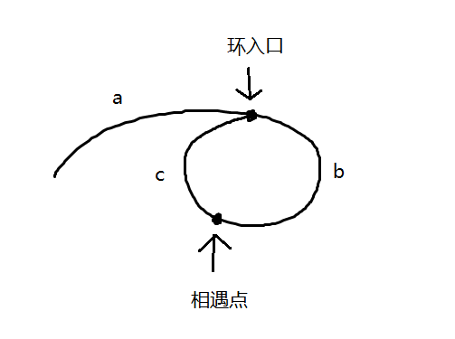

## 题目和前置

给出一个单链表，判断是否有环。如果有环，则返回环入口和环长度。

单链表节点结构
~~~java
package LinkedList;

public class Node {
    public Integer data;
    public Node next;

    public Node() {
        this.data = null;
        this.next = null;
    }

    public Node(int value) {
        this.data = value;
        this.next = null;
    }
}
~~~

随机环链表的对数器
~~~java
    /**
     * 生成环链表（入口随机）
     * @return 返回链表头节点
     */
    private Node getRingLinkedList(){
        Node head = new Node();
        Node next = head;
        Random random = new Random();
        int rand = random.nextInt(100);
        Node r = null;
        for (int i = 0; i < 100; i++) {
            next.next = new Node(random.nextInt(50));
            next = next.next;
            if (i == rand) {
                r = next;
            }
        }
        next.next = r;
        System.out.println("环入口："+r);
        System.out.println("环入口数据："+r.data);
        return head;
    }
~~~

## 使用辅助空间的解法

使用辅助空间存储节点地址，如果有重复的，则第一次出现重复的即为环的入口
环长度为重复元素出现位置的差

时间复杂度为 O(n)
空间复杂度也为 O(n)

代码实现：
~~~java
    /**
     * 判断一个链表是否有环，并返回环的入口
     * 使用 List集合 存储节点，第一次出现重复节点即为环的入口
     */
    public static Node findLoopPort1(Node head) {
        Node next = head.next;
        List<Node> list = new ArrayList<Node>();
        while (null != next) {
            for (int i = 0; i < list.size(); i++) {
                if (list.get(i) == next) {
                    System.out.println("环的长度：" + (list.size() - i));
                    return next;
                }
            }
            list.add(next);
            next = next.next;
        }
        return null;
    }
~~~

## 使用快慢指针的解法

设置快慢指针，慢指针每次走一步，快指针每次走两步。
有两个结论：
1. 如果链表有环，则他们一定会在环中相遇
2. 相遇后，让两个指针分别从表头和相遇点出发，每次走一步，最后一定会在环入口相遇

证明1：
首先快指针比慢指针走得快，所以当慢指针进入环中时，快指针一定在环中。
这时，相当于快指针在追慢指针。在慢指针走一圈之内一定会追上。

证明2：
表头到环入口长度为 a
环入口到相遇点长度为 b
相遇点到环入口长度为 c

快慢指针都从表头出发，到在相遇点相遇时：
慢指针路程为 `a + b`
快指针路程为 `a + (b + c) * k + b` 其中 (b+c) 是环长度，k是环的圈数。k>=1
快指针路程是慢指针的两倍： `a + (b + c) * k + b = 2 * (a + b)`

化简可以得到 `a = (k - 1)(b + c) + c`
他的意思是：表头到环入口的距离 = 相遇点到环入口的距离 + (k - 1)圈环长度
所以两指针分别从表头和相遇点出发，最后会在环入口相遇。

环长度可以让一指针从相遇点出发，另一指针在原地等。第一次相遇所走过的长度即为环长度

时间复杂度为 O(n)
空间复杂度为 O(1)

代码实现：
~~~java
    /**
     * 判断一个链表是否有环，并返回环的入口
     * 使用快慢指针实现
     */
    public static Node findLoopPort2(Node head) {
        Node p1 = head.next;
        Node p2 = head.next;
        while (p1.next != null && p2.next != null) {
            p1 = p1.next;
            p2 = p2.next.next;
            // 有环，会在环中某节点相遇
            if (p1 == p2) {
                break;
            }
        }
        // 无环 返回null
        if (p1.next == null || p2.next.next == null) {
            return null;
        }
        // 有环，计算环长度
        int count = 1;
        p1 = p1.next;
        while (p1 != p2) {
            p1 = p1.next;
            count++;
        }
        // 有环，两指针分别从起点和相遇点触发，最后会在环入口相遇
        p1 = head.next;
        while (p1 != p2) {
            p1 = p1.next;
            p2 = p2.next;
        }
        System.out.println("环的长度：" + count);
        return p1;
    }
~~~

参考：
[链表中环的入口节点](https://zhuanlan.zhihu.com/p/103626709) 膜拜大佬！