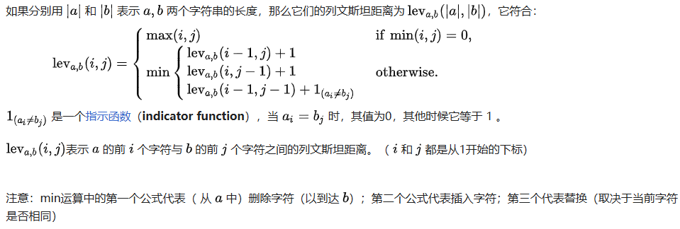

## Start

今天有个需求中需要定时同步数据，同步的判断条件是某个字段的相似度要大于 80%
于是有了下面这篇文章。

为了方便同步脚本的编写，提供了 Oracle 的函数版本，以便在sql中调用。

## Levenshtein距离

首先介绍下 [Levenshtein 距离（编辑距离）](https://zh.wikipedia.org/wiki/%E8%90%8A%E6%96%87%E6%96%AF%E5%9D%A6%E8%B7%9D%E9%9B%A2)

**莱文斯坦距离**（英语：Levenshtein distance）是编辑距离的一种。指两个字串之间，由一个转成另一个所需的最少编辑操作次数。

允许的编辑操作包括：
* 将一个字符替换成另一个字符
* 插入一个字符
* 删除一个字符

俄罗斯科学家弗拉基米尔·莱文斯坦在1965年提出这个概念。

下面是它的数学定义

## 字符串相似度的实现

### java 全矩阵迭代（动态规划） 实现

~~~java
    public static float getSimilarityRatio(String str, String target) {
        int temp; // 记录相同字符，在某个矩阵位置值的增量。相同为0，不同为1
        if (str.isEmpty() || target.isEmpty()) {
            return 0;
        }
        // 初始化矩阵
        int[][] d = new int[str.length() + 1][target.length() + 1];
        for (int i = 0; i <= str.length(); i++) { // 初始化第一列
            d[i][0] = i;
        }
        for (int j = 0; j <= target.length(); j++) { // 初始化第一行
            d[0][j] = j;
        }
        // 动态规划填充矩阵
        for (int i = 1; i <= str.length(); i++) {
            char ch1 = str.charAt(i - 1);
            for (int j = 1; j <= target.length(); j++) {
                char ch2 = target.charAt(j - 1);
                if (ch1 == ch2) {
                    temp = 0;
                } else {
                    temp = 1;
                }
                d[i][j] = Math.min(Math.min(d[i - 1][j] + 1, d[i][j - 1] + 1), d[i - 1][j - 1] + temp);
            }
        }
        // 计算相似度 1 - (Levenshtein 距离 / 两字符串最大长度) * 100%
        return (1 - (float) d[str.length()][target.length()] / Math.max(str.length(), target.length())) * 100F;
    }
~~~

### oracle 函数 全矩阵迭代 实现

~~~oraclesqlplus
-- 创建临时表，用于存储矩阵（过程值）
CREATE GLOBAL TEMPORARY TABLE similarity_matrix
(
    id1   NUMBER,
    id2   NUMBER,
    value NUMBER
) ON COMMIT DELETE ROWS;

-- 创建函数 计算字符串相似度

CREATE OR REPLACE FUNCTION func_get_similarity_ratio(str VARCHAR2, target VARCHAR2) RETURN NUMBER DETERMINISTIC IS
    -- 使用自治事务
    pragma autonomous_transaction;
    n     NUMBER := LENGTH(str);
    m     NUMBER := LENGTH(target);
    i     NUMBER;
    j     NUMBER;
    temp  NUMBER;
    d_val NUMBER;
    ch1   VARCHAR2(1);
    ch2   VARCHAR2(1);
BEGIN
    IF n = 0 OR m = 0 THEN
        RETURN 0;
    END IF;

    -- 初始化矩阵的第一列
    FOR i IN 0..n
        LOOP
            INSERT INTO similarity_matrix(id1, id2, value) VALUES (i, 0, i);
        END LOOP;

    -- 初始化矩阵的第一行
    FOR j IN 0..m
        LOOP
            INSERT INTO similarity_matrix(id1, id2, value) VALUES (0, j, j);
        END LOOP;

    -- 动态规划填充矩阵
    FOR i IN 1..n
        LOOP
            FOR j IN 1..m
                LOOP
                    ch1 := SUBSTR(str, i, 1);
                    ch2 := SUBSTR(target, j, 1);

                    IF ch1 = ch2 THEN
                        temp := 0;
                    ELSE
                        temp := 1;
                    END IF;

                    -- 获取三者中的最小值
                    SELECT MIN(value)
                    INTO d_val
                    FROM (SELECT value + 1 as value FROM similarity_matrix WHERE id1 = i - 1   AND id2 = j union
                          SELECT value + 1 as value FROM similarity_matrix WHERE id1 = i   AND id2 = j - 1 union
                          SELECT value + temp as value FROM similarity_matrix WHERE id1 = i - 1 AND id2 = j - 1);

                    -- 更新当前格子的值
                    INSERT INTO similarity_matrix(id1, id2, value) VALUES (i, j, d_val);
                END LOOP;
        END LOOP;

    SELECT value into d_val FROM similarity_matrix WHERE id1 = n AND id2 = m;
    commit;
    -- 计算并返回相似度
    RETURN (1 - round(d_val / GREATEST(n, m), 4)) * 100;
END func_get_similarity_ratio;

-- 调用函数测试
select func_get_similarity_ratio('12345a', '12345A') as ratio
from dual;
~~~

### java 递归实现

递归返回 Levenshtein 距离，相似度可按照 `1 - (Levenshtein 距离 / 两字符串最大长度) * 100%` 公式计算。

~~~java
    public static int getSimilarityRatio(String str, int strLength, String target, int targetLength) {
        // 递归回归点
        if (strLength == 0)
            return targetLength;
        if (targetLength == 0)
            return strLength;

        int cos;
        if (str.charAt(strLength - 1) == target.charAt(targetLength - 1))
            cos = 0;
        else
            cos = 1;

        int re1 = getSimilarityRatio(str, strLength - 1, target, targetLength) + 1;
        int re2 = getSimilarityRatio(str, strLength, target, targetLength - 1) + 1;
        int re3 = getSimilarityRatio(str, strLength - 1, target, targetLength - 1) + cos;
        // 三个中的最小值
        return re1 < re2 ? (Math.min(re1, re3)) : (Math.min(re2, re3));
    }
~~~

## End

这种基于矩阵迭代的算法，时间复杂度和空间复杂度都是 O(m * n) 。其中，m 是第一个字符串的长度，n 是第二个字符串的长度。
对于长字符串效率可能会较低。
